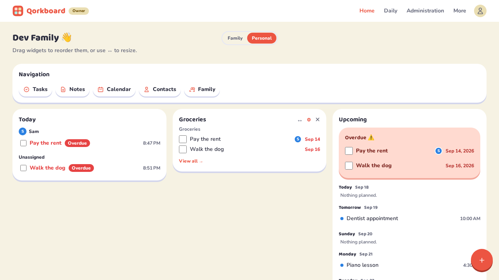
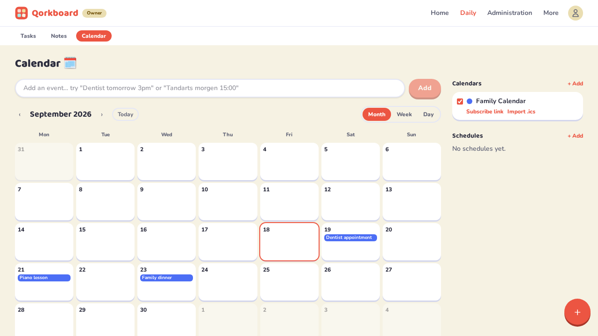
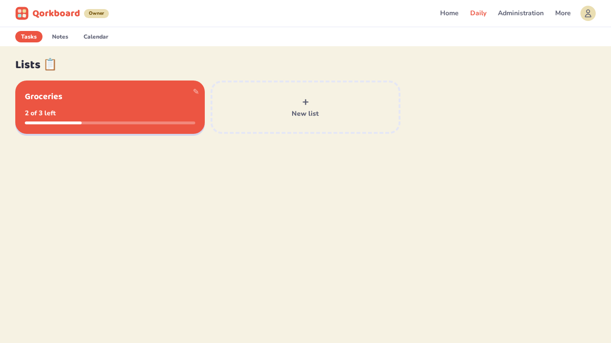
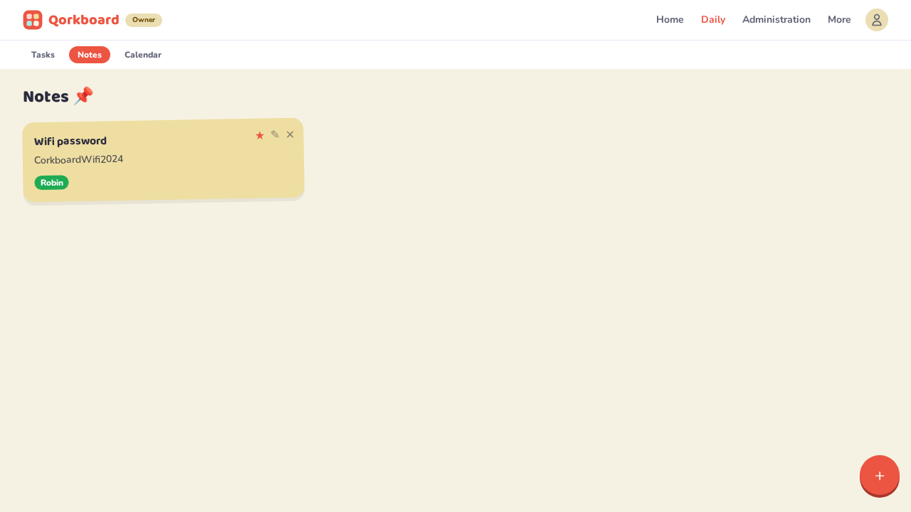
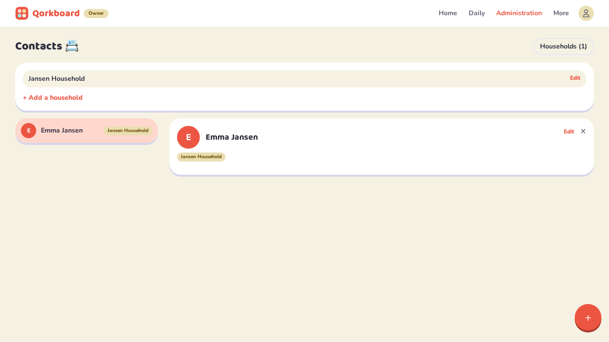
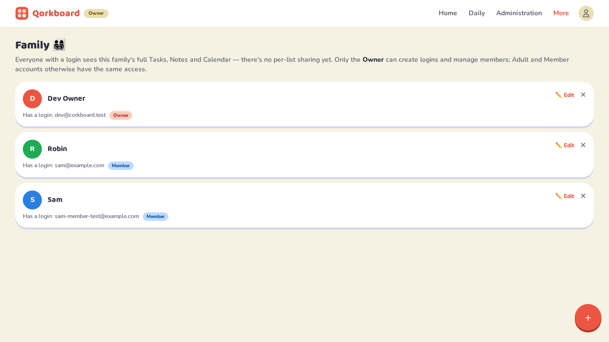
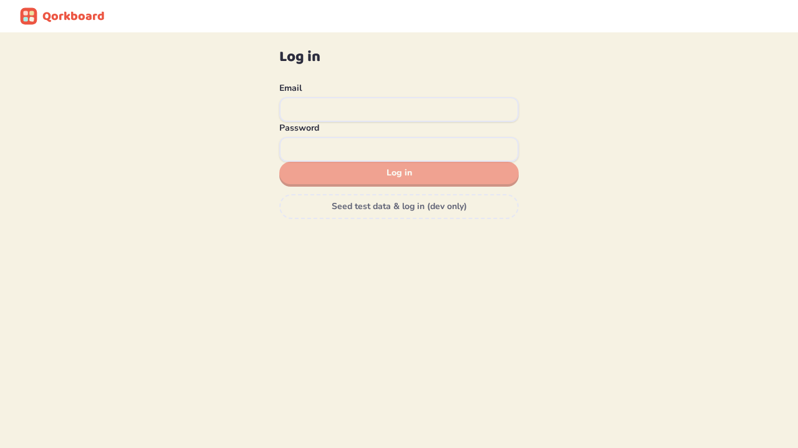

# Qorkboard

A family coordination app built for one family — not a generic multi-tenant
SaaS product. Appointments, tasks, notes, and contacts all live on one shared
board, self-hosted on your own hardware.



<details>
<summary>More screenshots</summary>

| | |
|---|---|
|  |  |
|  |  |
|  |  |

</details>

## Why

Commercial family-organizer apps come with ads, subscriptions, and features
nobody in the household asked for. Qorkboard is the opposite bet:

- **Self-hosted first.** You own the data and the deployment (a home
  server/NAS, via Docker).
- **One core abstraction.** Everything that can be "pinned to the board" —
  calendar appointments, tasks, notes, contacts — is a `Node` with a
  different `Type`, not four unrelated features bolted together.
- **API-first.** The backend has no server-rendered UI; the Angular client is
  just one consumer of the API, leaving the door open for a future mobile
  app or automation scripts.
- **Small surface.** Ship the smallest useful version, let real family use
  drive what gets built next.

## Features

- **Customizable dashboard** (`/home`) — widget-based home screen (Today,
  Upcoming, Tasks, Notes, Navigation, Timeline), drag-and-drop reordering,
  per-person or shared family layouts.
- **Calendar** — month/week/day views, multiple calendars, recurring
  appointments (RFC 5545 RRULE), per-occurrence overrides/skips, `.ics`
  import and one-way `.ics` export/subscribe feed.
- **Tasks** — lists ("Collections"), priorities, due dates, completion
  state.
- **Notes** — post-it style board, markable as important.
- **Contacts & Households** — an address book tied to the family.
- **Family management** — multiple family members per household, optional
  login accounts for the ones old enough to need them (kids/pets can exist
  without one).
- **Admin console** (`/admin`, system-owner only) — instance-wide stats,
  every family on the instance, and API client (client-credentials)
  management for external automation/integrations.
- **Installable PWA** — Angular service worker + manifest.

## Tech stack

| Layer | Stack |
|---|---|
| Backend | .NET 10, ASP.NET Core Web API (API-first, no server-rendered views) |
| Database | PostgreSQL via EF Core |
| Auth | ASP.NET Core Identity + JWT, plus client-credentials tokens for API clients |
| Scheduling | [TickerQ](https://github.com/Arcenox-co/TickerQ) (EF-Core-backed, in-process) |
| Calendar interop | [Ical.Net](https://github.com/ical-org/ical.net) for RRULE expansion and `.ics` import/export |
| Frontend | Angular 22 + Tailwind CSS, `@angular/cdk` for drag-and-drop |
| Component workshop | Storybook |
| Testing | xUnit (API), Playwright (e2e) |

## Project structure

```
src/
  Corkboard.Api/             # controllers, auth, DI wiring
  Corkboard.Domain/          # entities: Family, FamilyMember, Node (Note/Task/Appointment/Contact), ...
  Corkboard.Infrastructure/  # EF Core DbContext + migrations, TickerQ jobs, Identity, iCal
  Corkboard.Contracts/       # request/response DTOs shared with the client's shape
tests/
  Corkboard.Domain.Tests/
  Corkboard.Api.Tests/       # in-memory-DB unit tests + contract validation
client/                      # Angular 22 + Tailwind CSS PWA
  src/app/core/               # Auth, Families, FamilyMembers, Nodes, Collections, CalendarApi, Dashboard, Admin, ...
  src/app/pages/               # login, family-setup, add-members, home, tasks, task-list, notes, calendar,
                                # schedule-editor, contacts, family
  src/app/admin/                # system-owner-only shell: stats, families, api-clients
  e2e/                         # Playwright specs
docker-compose.yml            # Postgres (dev database)
```

## Getting started

Requirements: [Docker](https://docs.docker.com/get-docker/), the
[.NET 10 SDK](https://dotnet.microsoft.com/download), and Node.js/npm.

```bash
./scripts/dev.sh
```

This starts Postgres in Docker, waits for it to be healthy, applies pending
EF Core migrations, then runs the API and the Angular dev server together
(Ctrl+C stops both; Postgres keeps running — `docker compose down` to stop
it too). First run also installs `dotnet-ef` and `client/node_modules` if
missing.

- API: `http://localhost:5147`
- Client: `http://localhost:4200`

The first account you register becomes the instance's system owner and
walks through a first-run wizard (register → create family → add family
members) before landing on the dashboard.

### Running tests

```bash
dotnet test                    # .NET unit tests
npm --prefix client test       # Angular unit tests
npm --prefix client run e2e    # Playwright end-to-end tests
```

### Regenerating the screenshots

The images above are captured by a dedicated Playwright script, not hand-taken:

```bash
npm --prefix client run screenshots
```

It drives the seeded dev family (starting the dev stack itself if it isn't
already running), populates a small deterministic set of demo data, and
writes PNGs to `docs/screenshots/`. Rerun it after any meaningful UI change.

## Status

Actively developed, single-family use. See `CONCEPT.md` for the full design
document (domain model, API surface, and decisions log) and
`graphify-out/GRAPH_REPORT.md` for a generated map of the codebase.
